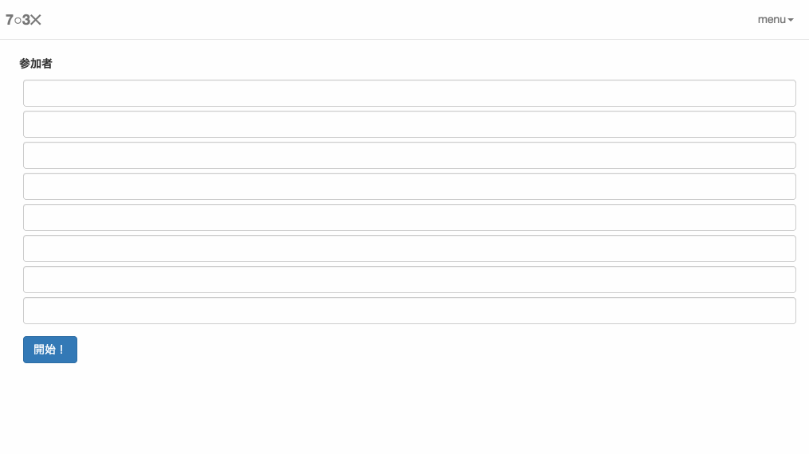

# QuizDisplay [](https://travis-ci.org/attakei/QuizDisplay)

早押しクイズの状態表示(React)


[](https://app.wercker.com/project/bykey/107d0dbcd3cd83c8105a7328c5f8dac3)


## 何をするものか

ブラウザ上で早押しクイズの得点状況表示をするアプリです。

[手っ取り早く試してみる](http://attakei.github.io/QuizDisplay/)



## 最近の変更

### ver 0.2.0

* n◯m✕の他に、+n/-m系ルールを追加


## 入手方法

### ビルド済みのもの

※これから準備する予定です

### ソースからビルドする

事前に、node.jsまたは互換環境を用意して下さい。また、現時点ではMacのみでビルド確認しています。

```shell
$ git checkout https://github.com/attakei/QuizDisplay.git
$ cd QuizDisplay
$ npm install
$ gulp
$ open app/index.html
```


## 技術的情報

### 組み込んでいる技術類(ライブラリなど)

- Bootstrap
    - jQuery
- React

### 開発に使っている技術類(ライブラリなど)

- node.js
- CoffeeScript
- jade
- Arda
- mocha
